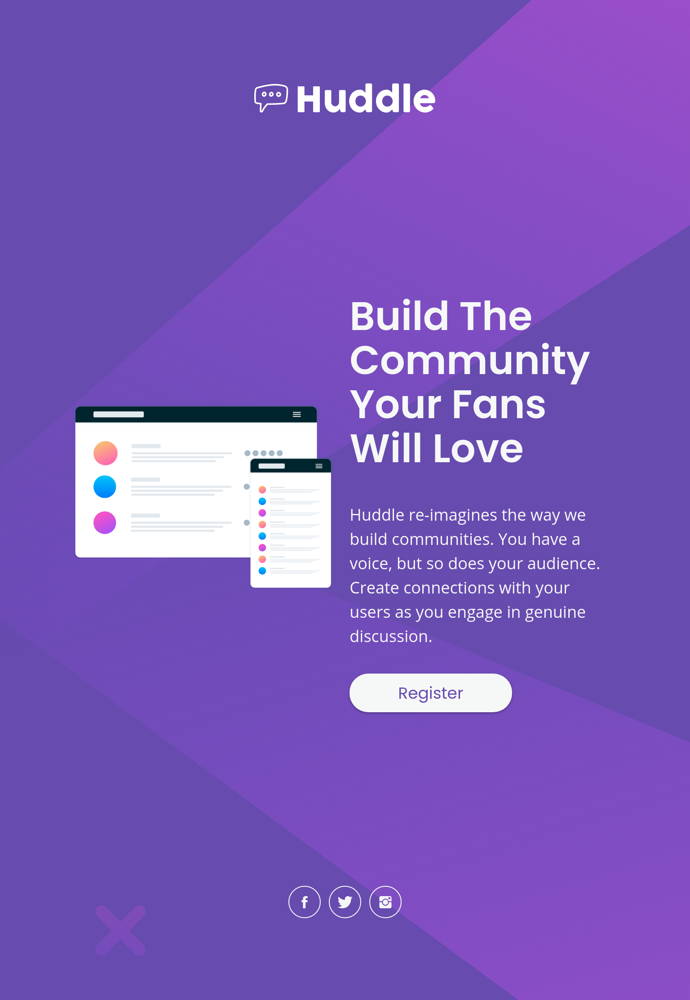

# Frontend Mentor - Huddle landing page with single introductory section solution

This is a solution to the [Huddle landing page with single introductory section challenge on Frontend Mentor](https://www.frontendmentor.io/challenges/huddle-landing-page-with-a-single-introductory-section-B_2Wvxgi0). Frontend Mentor challenges help you improve your coding skills by building realistic projects. 

## Table of contents

- [Overview](#overview)
  - [The challenge](#the-challenge)
  - [Screenshot](#screenshot)
  - [Links](#links)
- [My process](#my-process)
  - [Built with](#built-with)
  - [What I learned](#what-i-learned)
  - [Continued development](#continued-development)
  - [Useful resources](#useful-resources)
- [Author](#author)
- [Acknowledgments](#acknowledgments)

**Note: Delete this note and update the table of contents based on what sections you keep.**

## Overview

### The challenge

Users should be able to:

- View the optimal layout for the page depending on their device's screen size
- See hover states for all interactive elements on the page

### Screenshot





### Links

- Solution URL: [Add solution URL here](https://your-solution-url.com)
- Live Site URL: [Add live site URL here](https://your-live-site-url.com)

## My process

### Built with

- Semantic HTML5 markup
- CSS custom properties
- Flexbox
- Graceful-degradation workflow

### What I learned
1. Use of Figma to approximate font-sizes, line-heights margins, paddings, widths, and height percentages.

2. Use of flexbox alignment properties to evenly major page elements. Using `space-around` value of `justify-content` propert of flexbox, we can provide a responsive breathing space around each major elements (logo, main content, and social icons). No need to hard-code margin and padding values.

```css
.huddle-landing-page .landing-page-container {
    height: 100vh;
    width: 78.9%;
    max-width: 1280px;
    margin: 0 auto;
    display: flex;
    flex-direction: column;
    justify-content: space-around;
}
```

### Useful resources

- [Mozilla Developer Network](https://developer.mozilla.org/en-US/) - This help me understand fundamental HTML and CSS concepts
- [Type-Scale](https://type-scale.com/) - This helped me to quickly decide what font-size to use on my headings and paragraphs without worrying if they are in harmony or not.
- [Colormind](http://colormind.io/) - This helped me to quickly decide color combination for light colors given the two colors from the challenge's style-guide.

## Continued development

This challenge allows me to practice basic HTML/CSS concepts and it enhances my vanilla CSS coding. I desire to further improve my Vanilla CSS skills by taking more challenges.

## Author

- Github - [juani2](http://github.com/juani2)
- Frontend Mentor - [@juani2](https://www.frontendmentor.io/profile/juani2)

## Acknowledgments

I want to give thanks to Frontend mentor team and all those challengers that posts their solution. It really helped me in pulling this challenge off.
